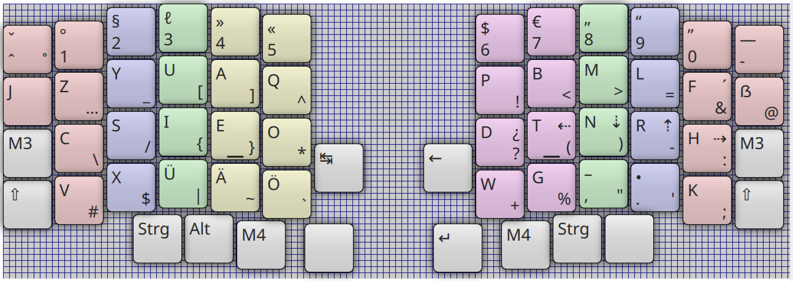

# KTouch layout and courses for the Lily58 keyboard

This repository contains a KTouch keyboard layout and courses for the Lily58.
The courses are generated using [ktgen](https://github.com/BarbieCue/ktgen) and [ktouch-lesson-generator](https://github.com/simgunz/ktouch-lesson-generator).



## Generate lessons for KTouch

To generate the lessons use the following command

```bash
make all
```

## Author

- Cristóbal Tapia Camú

## Thanks

- Jan Schreiber ([German dictionary](https://sourceforge.net/projects/germandict/))
- Dario Götz ([Noted layout](https://github.com/dariogoetz/noted-layout))
